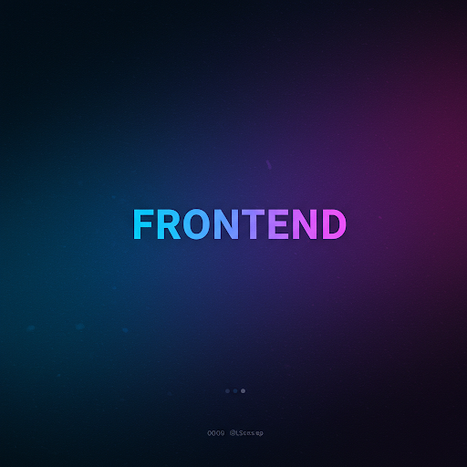
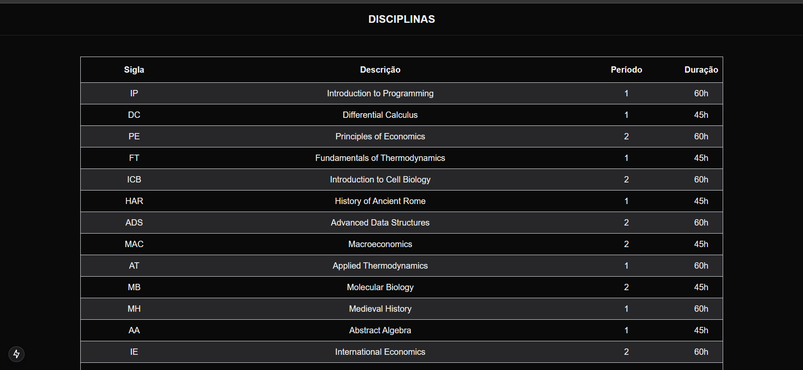

# Table disciplinas

<div align="center">



<div data-badges>
 
 
 
 

</div>

<div data-badges>
 
 
 
 
</div>

</div>

O `table_disciplinas` é um projeto frontend desenvolvido como parte dos requisitos da disciplina de Programação III. Seu objetivo principal é consumir os dados da API backend college_api e exibi-los em uma tabela organizada e de fácil leitura, focando especificamente nas informações das disciplinas.

## Funcionalidades:

- Consumo da API college_api: O projeto realiza requisições para a API backend [college_api](https://github.com/Pablo-Sts/college_api) para obter os dados das disciplinas.
- Exibição em tabela: Os dados recebidos são exibidos em uma tabela estruturada, com colunas para cada atributo relevante das disciplinas (nome, código, carga horária, etc.).
- Interface amigável: A interface do usuário é projetada para ser intuitiva e fácil de usar, permitindo que os usuários visualizem e compreendam as informações das disciplinas de forma clara.

## Tecnologias utilizadas:

- Next.js: O Next.js foi escolhido como framework para o desenvolvimento do frontend devido à sua capacidade de renderização do lado do servidor (SSR) e geração de sites estáticos (SSG), o que contribui para um melhor desempenho e SEO.
- Tailwind CSS: O Tailwind CSS foi utilizado para estilizar a interface do usuário, proporcionando um design moderno e responsivo com facilidade.
- TypeScript: O TypeScript foi utilizado para garantir a tipagem estática do código, melhorando a segurança e a manutenibilidade do projeto.

## Objetivo:

O projeto table_disciplinas demonstra a capacidade de construir um frontend moderno e eficiente, capaz de consumir dados de uma API backend e exibi-los de forma organizada e amigável. Ele serve como um exemplo prático de como integrar diferentes tecnologias para criar uma aplicação web completa.


## Como rodar esse projeto

### Requisitos

- Node.js instalado

### Execução

1. Clone esse repositório

    ```sh
    git clone https://github.com/Pablo-Sts/table_disciplinas
    ```

2. Acesse o diretório do projeto: 

    ```sh
    cd table_disciplinas
    ```

3. Copie as variáveis de ambiente listads e crie um arquivo `.env` e preencha com as seguintes informações:

    ```sh
     NEXT_PUBLIC_API =
    ```

5. Instale as dependênciads do projeto com o comando `npm i`.

6. Abra um terminal na pasta do projeto e execute o comando `npm run dev` para executar o projeto.

## Preview



## Links úteis

- [Next JS](https://nextjs.org/)
- [Tailwind CSS](https://tailwindcss.com/)